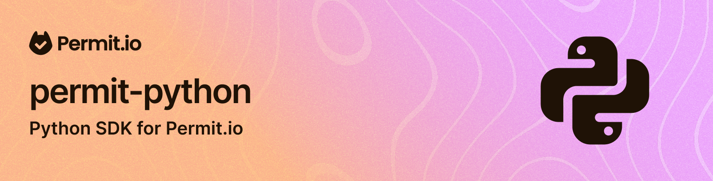

# Permit.io Python SDK

Python SDK for interacting with the Permit.io full-stack permissions platform.

## Installation

```py
pip install permit
```

## Documentation

[Read the documentation at Permit.io website](https://docs.permit.io/sdk/python/quickstart-python)

## Type checking

The package ships a `py.typed` marker (PEP 561), so mypy, pyright and IDEs check your
calls into the SDK against its type annotations. No pydantic mypy plugin is needed.

- The SDK's models are pydantic v1 models under both pydantic majors (with pydantic 2
  installed they come from `pydantic.v1`), and type checkers see them that way: use
  `.dict()` and `.json()` on them, not `.model_dump()`.
- Methods that take a model also accept an equivalent dict, such as
  `permit.api.users.create({"key": "user"})`, and bulk methods take a list of either.
  The dict is still validated at runtime.
- Model constructors are typed by their fields, so a nested model field takes a model
  instance, not a dict:
  `ResourceCreate(key="doc", name="Doc", actions={"read": ActionBlockEditable()})`.
  pydantic accepts a nested dict there at runtime, but a type checker rejects it. To
  pass plain dicts, give the whole payload to the API method as a dict instead.
- The blocking client, `permit.sync.Permit`, is typed as blocking:
  `permit.api.users.get("user")` returns a `UserRead`, not a coroutine.

## Deprecations

permit 4.0 removes the following. They still work in 3.x, and each one issues a
`DeprecationWarning` that says what to do instead.

- **pydantic 1 support.** On pydantic 1, `import permit` warns once. Upgrade to pydantic 2.
  The SDK's models then come from `pydantic.v1`, so their methods stay the same, but
  invalid input raises `pydantic.v1.ValidationError` rather than `pydantic.ValidationError`.
  Catching `pydantic.v1.ValidationError` works under both majors. Until you upgrade, the
  warning filter `ignore:Support for pydantic 1:DeprecationWarning` silences the import warning.
- **The flat methods on `permit.api`**, such as `permit.api.get_user()`. Use the grouped
  APIs instead, such as `permit.api.users.get()`. Each flat method's warning names its
  replacement.

By default, Python shows these warnings only when the code that triggers them is in
`__main__`, such as the script you run. pytest shows them in its warnings summary. To see
them elsewhere, such as in a web app, run Python with `-W default::DeprecationWarning` or
set the environment variable `PYTHONWARNINGS=default::DeprecationWarning`.
